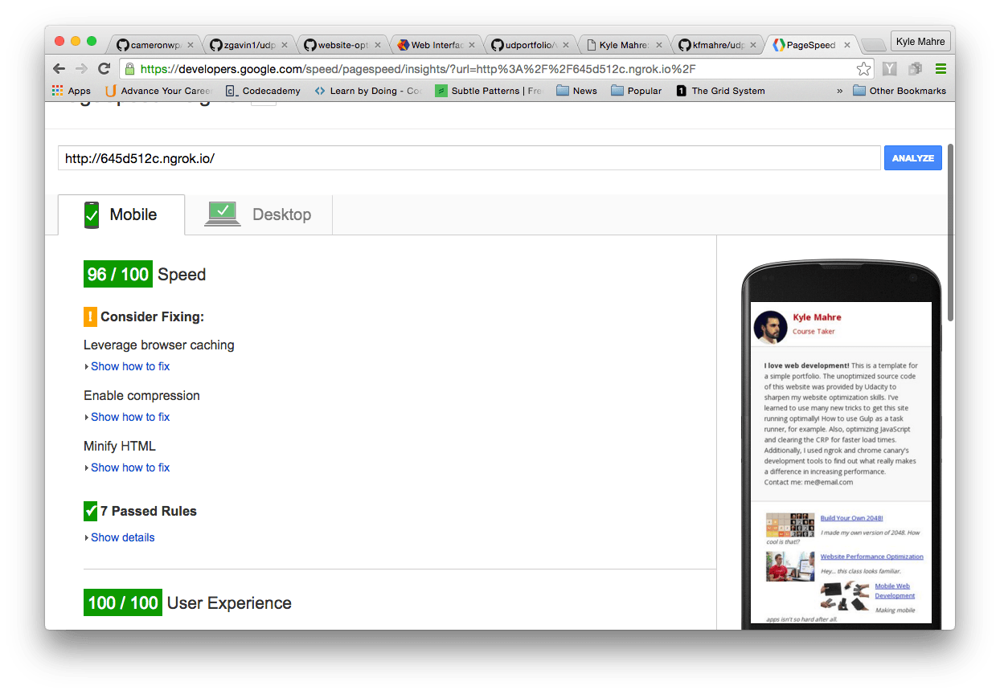
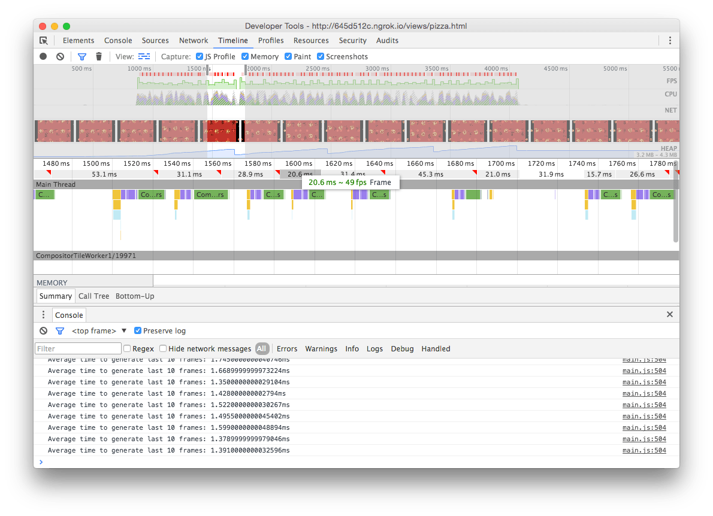

## Steps I took to complete this project
### Goals:
* Part 1: Achieve a pagespeed insights score of above 90 on index.html of the portfolio page.
* Part 2: Optimize the function for resizing pissas on pizza.html to do so in less than 5ms.
* Part 3: Achieve a framerate of 60fps when scrolling in pizza.html.
* Part 4: Make this documentation.

After viewing the classroom lessons and reviewing the code, I broke this project down into the three parts above. Then I added this documentation to the end.

## Part 1: 90 or above on pagespeed insights for index.html

1. I added print media query to print css to stop its render blocking.
2. I added async to google analytics.
3. I changed the size of the pizzeria picture to match how it's shown on index.html instead of shrinking such a huge image. I named that image pizzeriaMin.png. I also compressed the images using [ImageOptim](https://imageoptim.com/). I replaced Cam's picture with mine and optimized it also.
4. I'm a newbie at gulp, so this part took me a little bit to figure out. I minified inlined the CSS. This part got me to where I needed to be as far as pagespeed insights.



## Part 2: Pizza resize in pizza.html in less than 5ms

* Original Code

``` bash
  function changePizzaSizes(size) {
    for (var i = 0; i < document.querySelectorAll(".randomPizzaContainer").length; i++) {
      var dx = determineDx(document.querySelectorAll(".randomPizzaContainer")[i], size);
      var newwidth = (document.querySelectorAll(".randomPizzaContainer")[i].offsetWidth + dx) + 'px';
      document.querySelectorAll(".randomPizzaContainer")[i].style.width = newwidth;
    }
  }

  changePizzaSizes(size);
}
```
* First Changes

``` bash
  function changePizzaSizes(size) {

      var dx = determineDx(document.getElementsByClassName("randomPizzaContainer")[1], size);
      var newwidth = (document.getElementsByClassName("randomPizzaContainer")[1].offsetWidth + dx) + 'px';
      // Made this new variable from what was once the start of the function
      var pizzaContainerLength = document.getElementsByClassName("randomPizzaContainer").length;
    /* ---------------------------------------------
    I moved the for loop down here in the function,
    so that it calculates the variables first
    --------------------------------------------- */
    for (var i = 0; i < pizzaContainerLength; i++) {
      document.getElementsByClassName("randomPizzaContainer")[i].style.width = newwidth;
    }
  }

  changePizzaSizes(size);
}
```
* This got me to 2.44ms, well below 5ms. Then I noticed I could make it simpler:

* More Changes
```bash
  function changePizzaSizes(size) {

      var dx = determineDx(document.getElementsByClassName("randomPizzaContainer")[1], size);
      var newwidth = (document.getElementsByClassName("randomPizzaContainer")[1].offsetWidth + dx) + 'px';
      // Made this new variable from what was once the start of the function
      var pizzaElements = document.getElementsByClassName("randomPizzaContainer");
    /* ---------------------------------------------
    I moved the for loop down here in the function,
    so that it calculates the variables first
    --------------------------------------------- */
    for (var i = 0; i < pizzaElements.length; i++) {
      pizzaElements[i].style.width = newwidth;
    }
  }

  changePizzaSizes(size);
}
```
* That small change brought me from an average 2.44ms to 2.25ms


## Part 3: 60fps on scroll in pizza.html

Special thanks to mcs, forum mentor on Udacity's discussion forum. He really helped me get the ball rolling on this part of the project after I read this [post](https://discussions.udacity.com/t/project-4-how-do-i-optimize-the-background-pizzas-for-loop/36302). Also, thanks to for posting the [office hours](https://github.com/udacity/fend-office-hours/blob/master/Web%20Optimization/Effective%20Optimizations%20for%2060%20FPS/README.md).

1. I moved the DOM calculations out of the for-loop within updatePositions. Also, I changed out querySelectorAll for getElementsByClassName

* Original Code:
``` bash
function updatePositions() {
  frame++;
  window.performance.mark("mark_start_frame");

  var items = document.querySelectorAll('.mover');
  for (var i = 0; i < items.length; i++) {
    var phase = Math.sin((document.body.scrollTop / 1250) + (i % 5));
    items[i].style.left = items[i].basicLeft + 100 * phase + 'px';
  }
 }
```
* What I did:
``` bash
/* ----------------------------------------------------------------------
 querySelectorAll is slower than getElementsByClassName, I switched them
---------------------------------------------------------------------  */

function updatePositions() {
  frame++;
  window.performance.mark("mark_start_frame");

/* --- Moved these variables out of the for-loop --- */
  var scroll = document.body.scrollTop;
  var items = document.getElementsByClassName('mover');
  var itemsLength = items.length;

  for (var i = 0; i < itemsLength; i++) {
    var phase = Math.sin((scroll / 1250) + (i % 5));
    items[i].style.left = items[i].basicLeft + 100 * phase + 'px';
  }
 }
```

2. I moved styles out of the JavaScript and into the CSS .mover class

* Original code:
``` bash
document.addEventListener('DOMContentLoaded', function() {
  var cols = 8;
  var s = 256;
  for (var i = 0; i < 200; i++) {
    var elem = document.createElement('img');
    elem.className = 'mover';
    elem.src = "images/pizza.png";
    elem.style.height = "100px";
    elem.style.width = "73.333px";
    elem.basicLeft = (i % cols) * s;
    elem.style.top = (Math.floor(i / cols) * s) + 'px';
    document.querySelector("#movingPizzas1").appendChild(elem);
  }
  updatePositions();
}
```

* My Code in main.js:
``` bash
/* --------------------------------------------------------------------------------
I moved the styles code for the sizing of the pizzas to the css to the .mover class
-------------------------------------------------------------------------------- */

/* - Generates the sliding pizzas when the page loads.  */
document.addEventListener('DOMContentLoaded', function() {
  var cols = 8;
  var s = 256;
  for (var i = 0; i < 200; i++) {
    var elem = document.createElement('img');
    elem.className = 'mover';
    elem.src = "images/pizza.png";
    elem.basicLeft = (i % cols) * s;
    elem.style.top = (Math.floor(i / cols) * s) + 'px';
    document.querySelector("#movingPizzas1").appendChild(elem);
  }
  updatePositions();
}
```
* style.css:
``` bash
.mover {
  position: fixed;
  width: 73px;
  z-index: -1;
}
```
* My results from those changes were good, but not good enough:



* My attempt to optimize things further in updatepositions:
``` bash
function updatePositions() {
  frame++;
  window.performance.mark("mark_start_frame");

/* --- Moved these variables out of the for-loop --- */
  var scroll = (document.body.scrollTop / 1250);
  var items = document.getElementsByClassName('mover');
  var itemsLength = items.length;

  for (var i = 0; i < itemsLength; i++) {
    var phase = Math.sin(scroll + (i % 5));
    items[i].style.left = items[i].basicLeft + 100 * phase + 'px';
  }
```
* And then in addEventListener('DOMContentLoaded')
``` bash
document.addEventListener('DOMContentLoaded', function() {
  var cols = 8;
  var s = 256;
  var rows = Math.floor(window.screen.height / s);
  var elementNumber = cols * rows;
  var elem = [];
  var appendElementsHere = document.querySelector("#movingPizzas1");


  for (var i = 0; i < elementNumber; i++) {
    elem = document.createElement('img');
    elem.className = 'mover';
    elem.src = "images/pizza.png";
    elem.basicLeft = (i % cols) * s;
    elem.style.top = (Math.floor(i / cols) * s) + 'px';
    appendElementsHere.appendChild(elem);
  }
  updatePositions();
});
```

## Website Performance Optimization portfolio project

Your challenge, if you wish to accept it (and we sure hope you will), is to optimize this online portfolio for speed! In particular, optimize the critical rendering path and make this page render as quickly as possible by applying the techniques you've picked up in the [Critical Rendering Path course](https://www.udacity.com/course/ud884).

To get started, check out the repository, inspect the code,

### Getting started

Some useful tips to help you get started:

1. Check out the repository
1. To inspect the site on your phone, you can run a local server

  ```bash
  $> cd /path/to/your-project-folder
  $> python -m SimpleHTTPServer 8080
  ```

1. Open a browser and visit localhost:8080
1. Download and install [ngrok](https://ngrok.com/) to make your local server accessible remotely.

  ``` bash
  $> cd /path/to/your-project-folder
  $> ngrok 8080
  ```

1. Copy the public URL ngrok gives you and try running it through PageSpeed Insights! [More on integrating ngrok, Grunt and PageSpeed.](http://www.jamescryer.com/2014/06/12/grunt-pagespeed-and-ngrok-locally-testing/)

Profile, optimize, measure... and then lather, rinse, and repeat. Good luck!

### Optimization Tips and Tricks
* [Optimizing Performance](https://developers.google.com/web/fundamentals/performance/ "web performance")
* [Analyzing the Critical Rendering Path](https://developers.google.com/web/fundamentals/performance/critical-rendering-path/analyzing-crp.html "analyzing crp")
* [Optimizing the Critical Rendering Path](https://developers.google.com/web/fundamentals/performance/critical-rendering-path/optimizing-critical-rendering-path.html "optimize the crp!")
* [Avoiding Rendering Blocking CSS](https://developers.google.com/web/fundamentals/performance/critical-rendering-path/render-blocking-css.html "render blocking css")
* [Optimizing JavaScript](https://developers.google.com/web/fundamentals/performance/critical-rendering-path/adding-interactivity-with-javascript.html "javascript")
* [Measuring with Navigation Timing](https://developers.google.com/web/fundamentals/performance/critical-rendering-path/measure-crp.html "nav timing api"). We didn't cover the Navigation Timing API in the first two lessons but it's an incredibly useful tool for automated page profiling. I highly recommend reading.
* <a href="https://developers.google.com/web/fundamentals/performance/optimizing-content-efficiency/eliminate-downloads.html">The fewer the downloads, the better</a>
* <a href="https://developers.google.com/web/fundamentals/performance/optimizing-content-efficiency/optimize-encoding-and-transfer.html">Reduce the size of text</a>
* <a href="https://developers.google.com/web/fundamentals/performance/optimizing-content-efficiency/image-optimization.html">Optimize images</a>
* <a href="https://developers.google.com/web/fundamentals/performance/optimizing-content-efficiency/http-caching.html">HTTP caching</a>

### Customization with Bootstrap
The portfolio was built on Twitter's <a href="http://getbootstrap.com/">Bootstrap</a> framework. All custom styles are in `dist/css/portfolio.css` in the portfolio repo.

* <a href="http://getbootstrap.com/css/">Bootstrap's CSS Classes</a>
* <a href="http://getbootstrap.com/components/">Bootstrap's Components</a>

### Sample Portfolios

Feeling uninspired by the portfolio? Here's a list of cool portfolios I found after a few minutes of Googling.

* <a href="http://www.reddit.com/r/webdev/comments/280qkr/would_anybody_like_to_post_their_portfolio_site/">A great discussion about portfolios on reddit</a>
* <a href="http://ianlunn.co.uk/">http://ianlunn.co.uk/</a>
* <a href="http://www.adhamdannaway.com/portfolio">http://www.adhamdannaway.com/portfolio</a>
* <a href="http://www.timboelaars.nl/">http://www.timboelaars.nl/</a>
* <a href="http://futoryan.prosite.com/">http://futoryan.prosite.com/</a>
* <a href="http://playonpixels.prosite.com/21591/projects">http://playonpixels.prosite.com/21591/projects</a>
* <a href="http://colintrenter.prosite.com/">http://colintrenter.prosite.com/</a>
* <a href="http://calebmorris.prosite.com/">http://calebmorris.prosite.com/</a>
* <a href="http://www.cullywright.com/">http://www.cullywright.com/</a>
* <a href="http://yourjustlucky.com/">http://yourjustlucky.com/</a>
* <a href="http://nicoledominguez.com/portfolio/">http://nicoledominguez.com/portfolio/</a>
* <a href="http://www.roxannecook.com/">http://www.roxannecook.com/</a>
* <a href="http://www.84colors.com/portfolio.html">http://www.84colors.com/portfolio.html</a>
